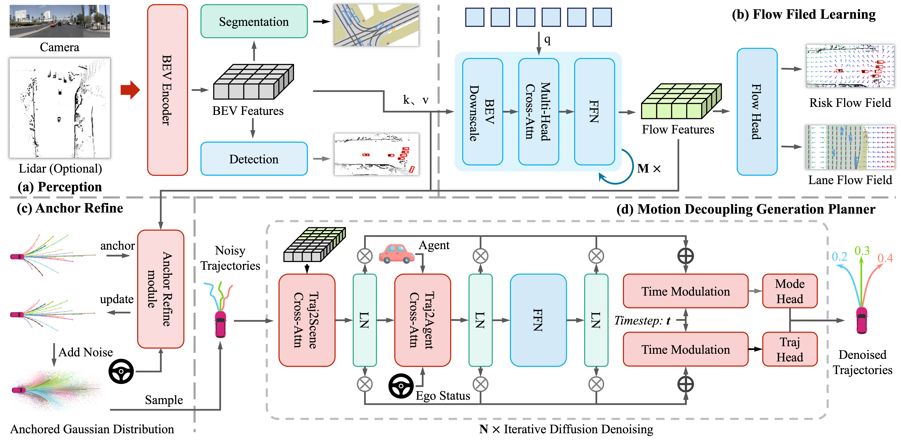

<div align="center">
<h3>FlowDrive: Energy Flow Field for End-to-End Autonomous Driving</h3>

[Hao Jiang](https://github.com/Sunstroperao)<sup>1</sup>, [Zhipeng Zhang](https://scholar.google.com/citations?hl=zh-CN&user=7Ws0QHYAAAAJ)<sup>1</sup>, Yu Gao<sup>2</sup>, [Zhigang Sun](https://github.com/SunZhigang7)<sup>2</sup>, Yiru Wang<sup>2</sup>, Yuwen Heng<sup>2</sup>, Shuo Wang<sup>2</sup>, Jinhao Chai<sup>4</sup>, Zhuo Chen<sup>1</sup>, Hao Zhao<sup>3</sup>, Hao Sun<sup>2</sup>, Xi Zhang<sup>1</sup>, [Anqing Jiang](https://github.com/PeterJaq)<sup>2✉</sup>, [Chuan Hu](https://scholar.google.com/citations?hl=zh-CN&user=xRgru9YAAAAJ)<sup>1✉</sup>

<sup>1</sup>Shanghai Jiao Tong University  
<sup>2</sup>Bosch Corporate Research, Shanghai, China
<sup>3</sup>AIR, Tsinghua University
<sup>4</sup>Shanghai University

(✉) Corresponding author.  


<a href="https://arxiv.org/abs/{}"></a>
<a href="https://github.com/IRL-VLA/{}"></a>
<a href="https://astrixdrive.github.io/FlowDrive.github.io/"></a>
<!-- <a href="https://ieeexplore.ieee.org/document/10592819"></a>
<a href="https://www.arxiv.org/pdf/2508.01778"></a>
<a href="https://www.arxiv.org/pdf/2508.01778"></a> -->

</div>

## 


## News
<!-- * **` Aug. 24th, 2025`:** We have released all driving pretraining QA, including 12 driving datasets and our own annotated NavSim data. We have rewritten the scoring, filtering, and evaluation for open-source data. If it’s helpful to you, feel free to star and cite our work! 🚗💨
* **` Aug. 21th, 2025`:** We release the initial version of code and weight on NAVSIM, along with documentation and training/evaluation scripts. We will also update our new revision of the paper and the pretraining datasets later this month or next month. Please stay tuned! ☕️ -->
* **`[2025/09/21]`:** We released our paper on [Arxiv](https://arxiv.org/abs/{}). Code/Models are coming soon. Please stay tuned! ☕️


## Updates
We are going to release code step by step:
- [x] Release Paper  
- [ ] Release Full Models and Training/Evaluation Framework   
- [ ] Release updated paper

**Please note:** The codebase is currently undergoing refactoring and polishing to prepare for its public release. We are committed to open-sourcing the full project and plan to do so in the coming months.

## Table of Contents
- [Abstract](#Abstract)
- [Getting Started](#getting-started)
- [Acknowledgement](#acknowledgement)
- [Citation](#citation)
<!-- - [Qualitative Results on NAVSIM Navtest](#qualitative-results-on-navsim-navtest) -->


## Abstract         
<div align="justify">
Recent advances in end-to-end autonomous driving leverage multi-view images to construct BEV representations for motion planning. In motion planning, autonomous vehicles need considering both hard constraints imposed by geometrically occupied obstacles (e.g., vehicles,  pedestrians) and soft, rule-based semantics with no explicit geometry (e.g., lane boundaries, traffic priors).  However, existing end-to-end frameworks typically rely on BEV features learned in an implicit manner, lacking explicit modeling of risk and guidance priors for safe and interpretable planning. To address this, we propose FlowDrive, a novel framework that introduces physically interpretable energy-based flow fields—including risk potential and lane attraction fields—to encode semantic priors and safety cues into the BEV space. These flow-aware features enable adaptive refinement of anchor trajectories and serve as interpretable guidance for trajectory generation. Moreover, FlowDrive decouples motion intent prediction from trajectory denoising via a conditional diffusion planner with feature-level gating, alleviating task interference and enhancing multimodal diversity. Experiments on the NAVSIM v2 benchmark demonstrate that FlowDrive achieves state-of-the-art performance with an EPDMS of 86.3, surpassing prior baselines in both safety and planning quality.


</div>


## Getting Started
- [Download NAVSIM datasets following official instruction](https://github.com/autonomousvision/navsim/blob/main/docs/install.md)
- [Preparation of FlowDrive environment](docs/install.md)
- [FlowDrive Training and Evaluation](docs/train_eval.md)


## Acknowledgement

FlowDrive is greatly inspired by the following outstanding contributions to the open-source community: [NAVSIM](https://github.com/autonomousvision/navsim), [Transfuser](https://github.com/autonomousvision/transfuser), [DiffusionDrive](https://github.com/hustvl/DiffusionDrive), [GoalFlow](https://github.com/YvanYin/GoalFlow).

## Citation

If you find FlowDrive is useful in your research or applications, please consider giving us a star 🌟 and citing it by the following BibTeX entry.

```bibtex
@misc{jiang2025flowdriveenergyflowfield,
      title={FlowDrive: Energy Flow Field for End-to-End Autonomous Driving}, 
      author={Hao Jiang and Zhipeng Zhang and Yu Gao and Zhigang Sun and Yiru Wang and Yuwen Heng and Shuo Wang and Jinhao Chai and Zhuo Chen and Hao Zhao and Hao Sun and Xi Zhang and Anqing Jiang and Chuan Hu},
      year={2025},
      eprint={2509.14303},
      archivePrefix={arXiv},
      primaryClass={cs.RO},
      url={https://arxiv.org/abs/2509.14303}, 
}
```


